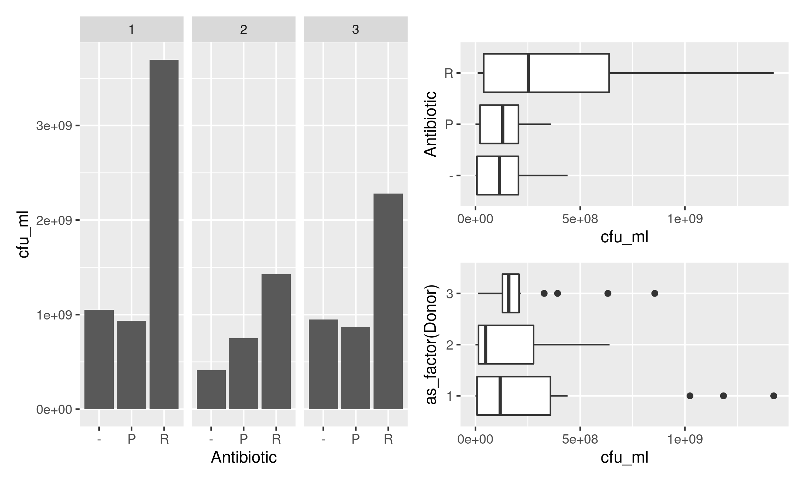

# Group 8 final project


```{r setup, include=FALSE}
source(file = "/cloud/project/R/00_doit.R")
```

## Introduction

This project used data from the 2020 paper from (authors) about gut microbiota populations in patients inoculated with a specific *E. coli* strain and then treated with two diferent antibiotics.

## Materials and methods

This project used data from the 2020 paper from (authors). The data provided by the authors was stored into 3 different files: 

*   **ctu_counts**: A .csv file containing information about the abundance of *E. coli* for each treatment.

*   **mapfile**: Metadata mapping file containing sequencing and experimental information for each sample.

*   **otufile**: OTU abundance and taxonomic identification file.

---

*   **ctu_counts**: A .csv file containing information about the abundance of *E. coli* for each treatment.

```{r, echo = FALSE, message = FALSE}
cfu_df
```

---

*   **mapfile**: Metadata mapping file containing sequencing and experimental information for each sample.
```{r, echo = FALSE, message = FALSE}
map_df
```

---

*   **otufile**: OTU abundance and taxonomic identification file.
```{r, echo = FALSE, message = FALSE}
otu_df
```

---

### Tidying the data

The main tidying issue was with the *otufile* file. In that file observations were introduced as columns, and the "family" variable had to be separated from the rest of the taxa. After that the OTU variable had to be removed and group the obserbations by family.

```{r, echo = FALSE, message = FALSE}
otu_df_clean
```

## Data visualization

The resulting plots obtained from this data consisted in a heatmap to visualize the abundance of each family of baceria in the different subjects, with the different treatments, some violin plots, boxplots and barplots as described next in more detail.

```{r figura refacherita, echo=FALSE, out.width="600px", fig.align="center"}

```


### General visualization of data from the *cfu* file

*   Wrangling the data:
```{r, eval=c(2)}
model_ii_data <- read_tsv("data/cfu_clean.tsv") %>% 
  select(!c(plateID, Replicate, Dilution))
model_ii_data
```

*   Plotting the data:
```{r, echo=FALSE}
general_plot
```

### Visualization of family abundance

*   Wrangling the data:
```{r, eval=c(2)}
heat_map_data <- read_tsv("data/otu_map_merged.tsv", show_col_types = FALSE) %>%
  pivot_longer(c(Ruminococcaceae,Enterobacteriaceae,Lachnospiraceae,Bifidobacteriaceae,Clostridiaceae_1,Erysipelotrichaceae,Bacteroidaceae,Coriobacteriaceae,Porphyromonadaceae,Enterococcaceae),
               names_to = "family",
               values_to = "counts")
heat_map_data
```