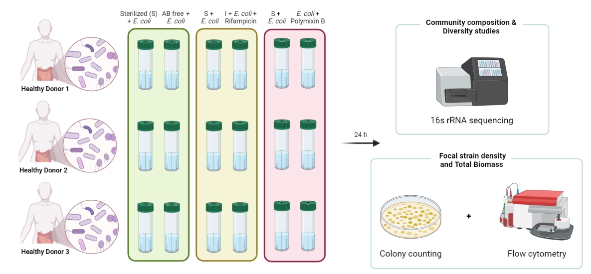
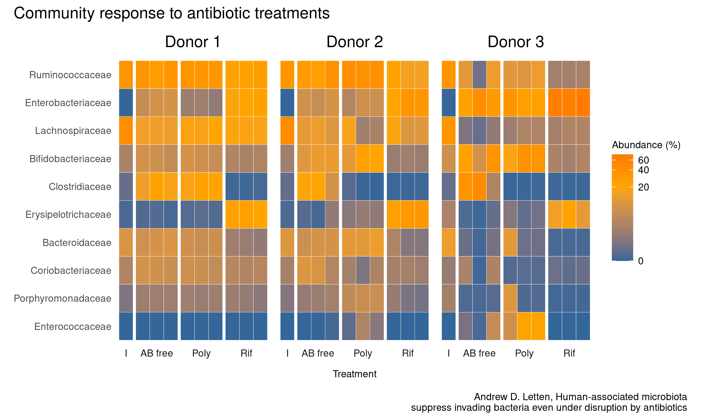
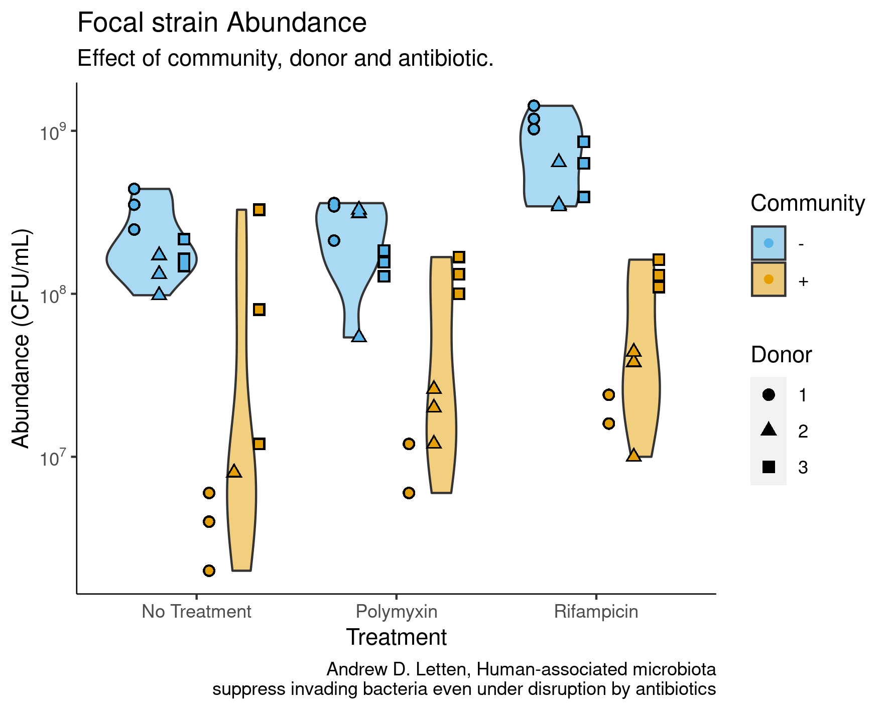

```{r setup, include=FALSE}
library(knitr)
library(kableExtra)
```


<style>
body {
text-align: justify}
</style>

## Introduction | The study{#intro data-background="#FFFFFF"}
<style> 
  #intro > p { 
    margin-top: -50px; 
  } 
</style>

<font size = "3"> It is known that the use of broad-spectrum antibiotics
can promote the spread of resistant strains by competition. A previous
study by Letten, A.D., Baumgartner, M., Pfrunder-Cardozo, K.R. et al.
(2021) analysed the competitive suppression of a resistant strain of *E.
coli* inoculated into human gut-microbiota populations within the
presence and absence of rifampicin and polymyxin B. </font> 
<br>
<br>
```{r fig0, echo=FALSE, out.width="600x", fig.align="center"}

```

## Materials and methods{data-background="#FFFFFF"}

<font size = "3"> Data extracted from Letten, A.D., Baumgartner, M.,
Pfrunder-Cardozo, K.R. et al.(2021).</font>
<pre>

</pre>
```{r fig1, echo=FALSE, out.width="700x", fig.align="center"}
knitr::include_graphics("doc/workflow.jpeg")
```

## Tidying the data{.small data-background="#FFFFFF"}

-   *CFU Raw file*
```{r, echo = FALSE, message = FALSE}
kableExtra::kable(cfu_df[1:3,], "html") %>%
  kable_styling(bootstrap_options = "striped", font_size = 12, full_width = FALSE)
```
<pre>

</pre>

-   *CFU Tidy file*
```{r, echo = FALSE, message = FALSE}
kableExtra::kable(cfu_df_clean[1:3,], "html") %>%
  kable_styling(bootstrap_options = "striped", font_size = 12, full_width = FALSE)
```

## Tidying the data{.small data-background="#FFFFFF"}

-   *OTU Raw file*
```{r, echo = FALSE, message = FALSE}
otu_table <- otu_df %>% 
  select(`#OTU ID`,A01,A30,"Consensus Lineage")
kableExtra::kable(otu_table[1:3,], "html") %>%
  kable_styling(bootstrap_options = "striped", font_size = 10, full_width = FALSE)
```
<pre>

</pre>
-   *OTU Tidy file*

```{r, echo = FALSE, message = FALSE}
otu_clean_table <- otu_df_clean %>% 
  select(OTU,A01,A30,realm,phylum,class,order,family,genus)
kableExtra::kable(otu_clean_table[1:3,], "html") %>%
  kable_styling(bootstrap_options = "striped", font_size = 10, full_width = FALSE)
```

## Tidying the data{.small data-background="#FFFFFF"}

-   *MAP Raw file*
```{r, echo = FALSE, message = FALSE}
map_table <- map_df %>% 
  select(SampleID, PrimerSequenceForward, Donor, Antibiotic, Name)
kableExtra::kable(map_table[1:3,], "html") %>%
  kable_styling(bootstrap_options = "striped", font_size = 10, full_width = FALSE)
```
<pre>

</pre>
-   *MAP Tidy file*
```{r, echo = FALSE, message = FALSE}
kableExtra::kable(map_df_clean[1:3,], "html") %>%
  kable_styling(bootstrap_options = "striped", font_size = 10, full_width = FALSE)
```

## Data visualization | General visualisation{#general data-background="#FFFFFF"}

<style> 
  #general > p { 
    margin-top: -30px; 
  } 
</style>
```{r fig2, echo=FALSE, out.width="630px", fig.align="center"}
knitr::include_graphics("results/general_plot.png")
```

## Data visualization | Violin plot{#violin data-background="#FFFFFF"}

<style> 
  #violin > p { 
    margin-top: -60px; 
  } 
</style>
```{r fig6, echo=FALSE, out.width="550px", fig.align="center"}

```

## Data visualization | Heatmap{#heatmap data-background="#FFFFFF"}

<style> 
  #heatmap > p { 
    margin-top: -30px; 
  } 
</style>
```{r fig3, echo=FALSE, out.width="800px", fig.align="center"}

```

## Data visualization | Cluster plot{#cluster data-background="#FFFFFF"}

<style> 
  #cluster > p { 
    margin-top: -30px; 
  } 
</style>

```{r fig5, echo=FALSE, out.width="700px", fig.align="center"}
knitr::include_graphics("results/NMDS_plot.png")
```

## Data visualization - Conclusion | Violin plot by community{#community data-background="#FFFFFF"}

<style> 
  #community > p { 
    margin-top: -30px; 
  } 
</style>
```{r fig4, echo=FALSE, out.width="600px", fig.align="center"}

```
