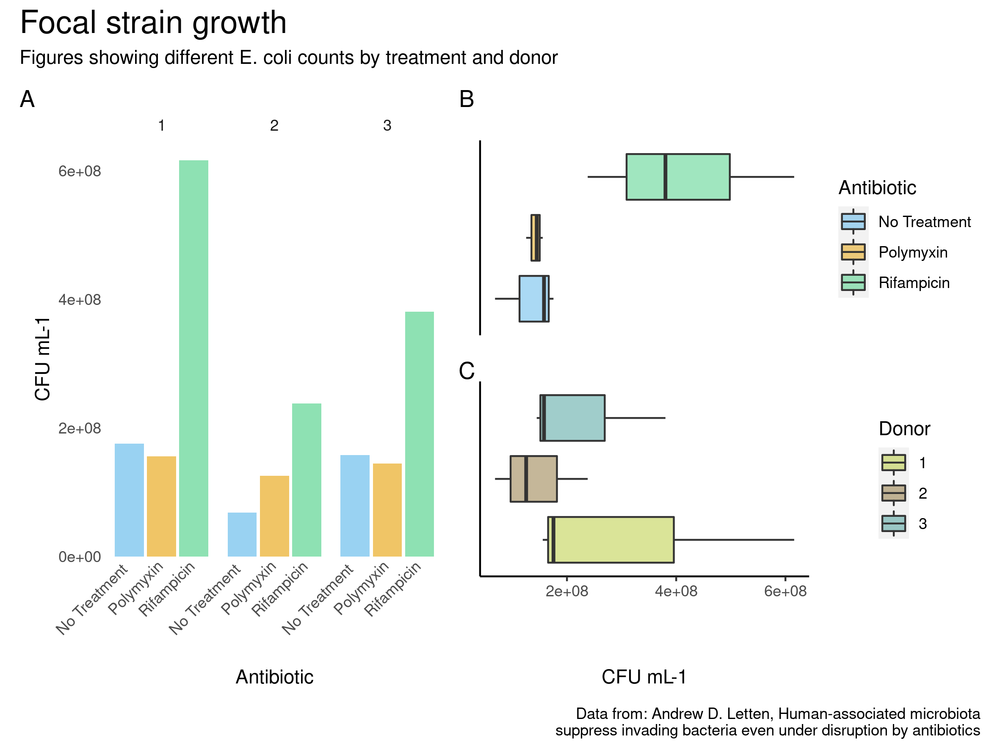

```{r setup, include=FALSE}
source(file = "/cloud/project/R/00_doit.R")
```

<style>
body {
text-align: justify}
</style>

## Introduction | The study{#methods} 
<style> 
  #methods > p { 
    margin-top: -50px; 
  } 
</style>

<font size = "3"> It is known that the use of broad-spectrum antibiotics
can promote the spread of resistant strains by competition. A previous
study by Letten, A.D., Baumgartner, M., Pfrunder-Cardozo, K.R. et al.
(2021) analysed the competitive suppression of a resistant strain of *E.
coli* inoculated into human gut-microbiota populations within the
presence and absence of rifampicin and polymyxin B. </font>


```{r fig0, echo=FALSE, out.width="600x", fig.align="bottom"}


knitr::include_graphics("doc/methods.jpeg")
```

## Materials and methods

<font size = "3"> Data extracted from Letten, A.D., Baumgartner, M., Pfrunder-Cardozo, K.R. et al.(2021).</font>

```{r fig1, echo=FALSE, out.width="700x", fig.align="center"}

```

## Raw files
- *CFU file*
```{r, echo = FALSE, message = FALSE}
cfu_df[1:3,]
```
- *OTU file*
```{r, echo = FALSE, message = FALSE}
otu_df[1:3,]
```
- *Map file*
```{r, echo = FALSE, message = FALSE}
map_df[1:3,]
```

## Tidying the data

-  *cfu_counts*

<font size = "3"> In order to process this data for visualization, the
*Treatment* column mentioned earlier had to be spliced in 3 new columns
for the contained variables *Donor*, *community*, and *Antibiotic* as it
follows: </font>

```{r, echo = FALSE, message = FALSE}
cfu_df_clean
```


### Tidying the data

-  *otufile*

<font size="3"> Data from *mapfile* was already tidy, but data from
*otufile* had to be modified, in order to group all observations by
family. </font>

```{r, echo = FALSE, message = FALSE}
options(width = 50)
otu_df_clean
```

### Tidying the data

#### *mapfile* and *otufile* merging (augmented data)

<font size="3"> Prior to do relevant visualizations, data from the
*mapfile* and *otufile* had to be combined. Now that variables in
*otufile* were properly grouped, observations were transposed so we had
a row for each of them, and then data could be ,erged as it follows:
</font>

```{r, echo = FALSE, message = FALSE}
merged_df
```

## Data visualization

<font size="3"> The resulting plots obtained from this data consisted in
a heatmap to visualize the abundance of each family of baceria in the
different subjects, with the different treatments, some violin plots,
boxplots and barplots as described next in more detail. </font>

------------------------------------------------------------------------

```{r fig2, echo=FALSE, out.width="600px", fig.align="center"}

```

------------------------------------------------------------------------

```{r fig3, echo=FALSE, out.width="600px", fig.align="center"}
knitr::include_graphics("results/heatmap.png")
```

------------------------------------------------------------------------

```{r fig4, echo=FALSE, out.width="600px", fig.align="center"}
knitr::include_graphics("results/violin_1_A.png")
```

------------------------------------------------------------------------

```{r fig5, echo=FALSE, out.width="600px", fig.align="center"}
knitr::include_graphics("results/NMDS_plot.png")
```

------------------------------------------------------------------------

### General visualization of data from the *cfu* file

-   Wrangling the data:

```{r, eval=c(2)}
model_ii_data <- read_tsv("data/cfu_clean.tsv") %>% 
  select(!c(plateID, Replicate, Dilution))
model_ii_data
```

-   Plotting the data:

```{r, echo=FALSE}
general_plot
```

### Visualization of family abundance

-   Wrangling the data:

```{r, eval=c(2)}
heat_map_data <- read_tsv("data/otu_map_merged.tsv", show_col_types = FALSE) %>%
  pivot_longer(c(Ruminococcaceae,Enterobacteriaceae,Lachnospiraceae,Bifidobacteriaceae,Clostridiaceae_1,Erysipelotrichaceae,Bacteroidaceae,Coriobacteriaceae,Porphyromonadaceae,Enterococcaceae),
               names_to = "family",
               values_to = "counts")
heat_map_data
```
